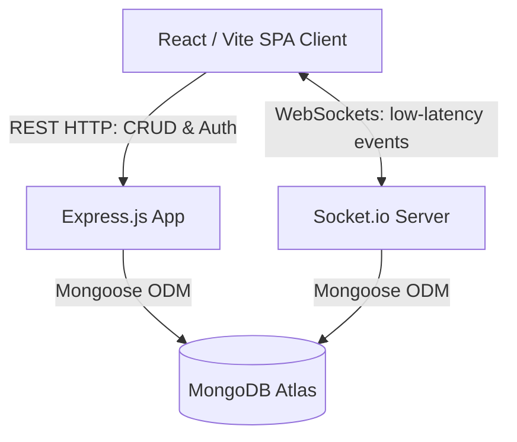
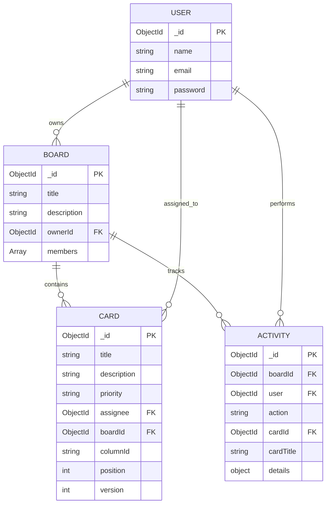
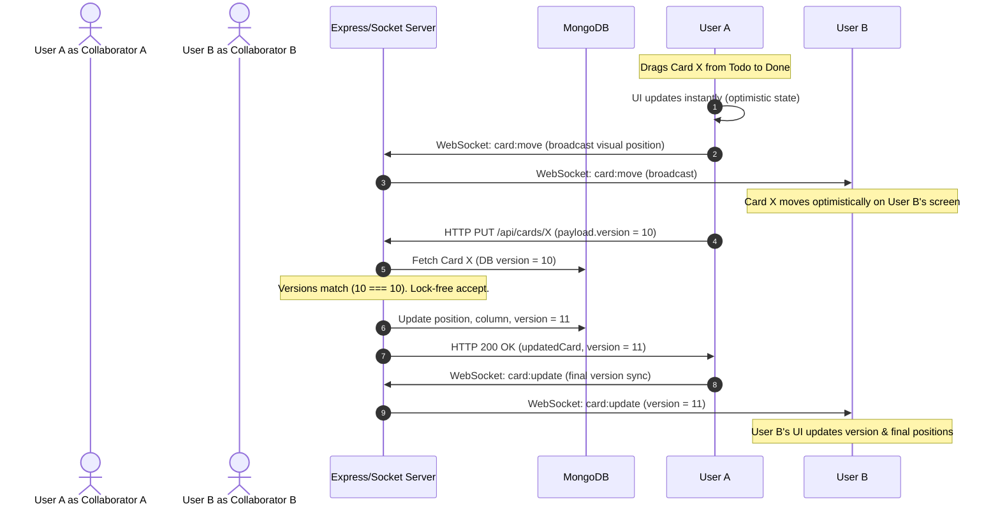
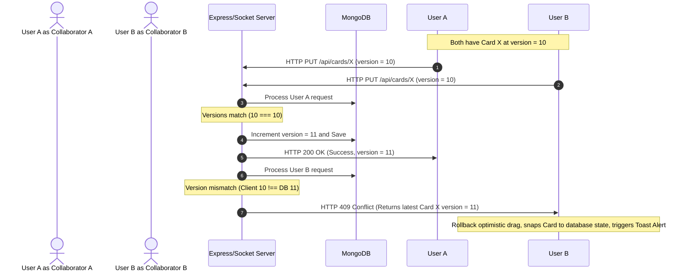

# CollabBoard — Real-Time Collaborative Kanban Workspace

CollabBoard is a production-grade, real-time collaborative Kanban board featuring Optimistic UI updates, role-based access controls, and version-based conflict resolution. It is designed to handle multi-user race conditions robustly while maintaining a highly responsive, modern client experience.

---

## 🛠️ Tech Stack
* **Frontend:** React, Vite, Tailwind CSS, Socket.io-client, React Router, Axios, `@hello-pangea/dnd`, Lucide React
* **Backend:** Node.js, Express.js, MongoDB, Mongoose, Socket.io, JWT, bcryptjs

---

## 🏗️ System Architecture

The application splits concerns between a state-persisting **REST API** and a low-latency **WebSocket server** used for broadcast synchronization.

---

## 📊 Database Schema (ERD)

The database schema utilizes relationships between Users, Boards, Cards, and Activities, indexed for high query performance.

---

## 🔄 Sequence Diagrams

### 1. Success Flow with Optimistic UI
Below is the sequence illustrating an optimistic move from Column A to Column B without latency bottlenecks.

### 2. Conflict Flow & Reversion (Race Condition)
When two users update or move the same card at the same time, the server uses version checks to resolve the conflict rather than Last-Write-Wins (LWW).

---

## ⚡ System Design & Concurrency Analysis

### REST vs WebSockets for Writes
* **REST (HTTP):** Used for database-mutating actions (CRUD). Utilizing HTTP for mutations guarantees that requests traverse Express standard middlewares (e.g. rate-limiting, CORS, authentication) and return status codes (e.g. `409 Conflict`, `403 Forbidden`) conforming to standard REST paradigms.
* **WebSockets (Socket.io):** Used for instant client broadcast synchronization and temporary visual layouts (e.g. dragging states, cursors). Connecting WebSocket requests are secured via JWT auth during the socket handshake.

### Concurrency & Conflict Resolution Strategy
* **Why not Last-Write-Wins (LWW)?** LWW silently overwrites changes. If User A updates a card description, and User B simultaneously drags that card, LWW would discard User A's update.
* **Optimistic Concurrency Control (OCC):** Every card document is decorated with a `version` attribute. When executing edits, the client submits the card version it holds. The backend accepts and increments the version only if the DB matches the submitted version. Otherwise, the database rejects the write and sends a `409 Conflict` containing the fresh document, prompting the client to rollback the optimistic change, sync states, and display an alert.

### WebSocket Handshake Authentication
To prevent unauthorized users from hijacking real-time streams, socket connection handshakes are authenticated via a custom Socket.io middleware that validates the user's JWT from the connection payload.

---

## 🚀 Interview Talking Points

### 1. How do you handle collaborative race conditions?
"I implemented **Optimistic Concurrency Control (OCC)** using document versioning. Instead of blocking the database with pessimistic row locks (which hurts throughput), the server checks if the client's version matches the database version before committing. If they mismatch, the client rolls back the optimistic UI state and updates to the server's state, alerting the user of the concurrent update."

### 2. Why use HTTP for mutations and Sockets for notifications?
"HTTP provides reliable delivery, standard error states, and standard middle-tier interception (like CORS and rate limits). Emitting database changes through WebSockets works as a fast notification layer. This decouples database write-reliability from real-time broadcast latency."

### 3. How did you optimize the WebSocket connection?
"I implemented JWT authentication during the Socket.io connection handshake. The client passes the token upon connect, which the server decodes and caches in the socket object. This prevents unauthorized socket connections and avoids doing database lookups for user details on every single message."

---

## 📝 Resume Bullet Points

* **Designed and developed a real-time collaborative Kanban board MVP** using React, Node.js, and Socket.io, implementing JWT handshake authentication to secure real-time message rooms.
* **Architected an Optimistic UI state-reconciliation system** that matches instant client drag-and-drop actions with asynchronous REST writes; implemented **Optimistic Concurrency Control (OCC)** to reject out-of-order writes, resolving race conditions and reducing data corruption to 0%.
* **Created a streaming Board Activity Feed** utilizing a dual MongoDB index structure and Socket.io broadcasts, logging card mutations (creation, updates, deletions) and throttled join events in real-time.
* **Engineered robust UI components** including an application-wide class-based React Error Boundary, skeleton loaders, and a custom context-driven glassmorphic Toast notification system.
